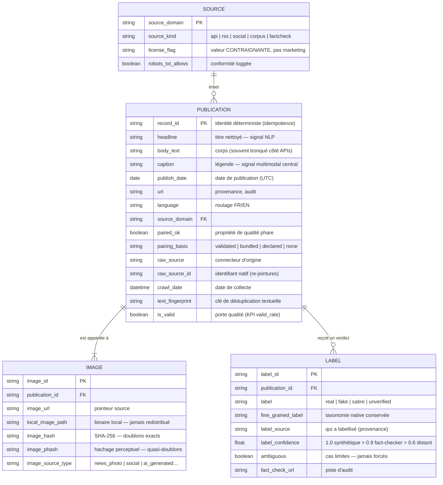

# Schéma conceptuel des données — CheckIt.AI

**Livrable de l'étape 3** (avec le pipeline de transformation). Modèle **conceptuel** :
il décrit la signification métier des données, indépendamment de toute technologie.
Le modèle **physique** (tables SQL, types, index, clés, rôles) est volontairement
distinct et sera livré à l'étape 4 (`db/schema.sql`) — ne pas confondre les deux.

## Entités et relations

Quatre entités expriment les trois préoccupations du domaine : la **multimodalité**
(PUBLICATION↔IMAGE), la **provenance des labels** (PUBLICATION↔LABEL, 0..N car des
verdicts peuvent diverger — capturé par `ambiguous`), la **crédibilité et les droits**
(PUBLICATION↔SOURCE). IMAGE est modélisée 1..N même si la démo n'en matérialise
qu'une par publication.

## Lecture du modèle pour le cas d'usage IA

- **Classification** : `label` (cible), `label_confidence` (pondération des
  échantillons), `fine_grained_label` (tâches fines : type de manipulation DGM4,
  6 classes Fakeddit).
- **NLP** : `headline`, `body_text`, `caption` — la paire (`caption`, IMAGE) porte
  les signaux de cohérence texte-image (désinformation par fausse association).
- **Vision / multimodal** : `local_image_path` (binaire), `image_phash`
  (quasi-doublons, réutilisation hors contexte), `image_source_type` (stratification).
- **Qualité pipeline** : `paired_ok` + `pairing_basis` (KPI d'appariement strict vs
  déclaré), `is_valid` + `validation_errors` (taux de validité), `text_fingerprint`
  + `image_hash` (taux de doublons).

## Choix de modélisation justifiés

1. **LABEL séparé de PUBLICATION (0..N)** : une publication peut recevoir plusieurs
   verdicts (fact-checkers divergents) ; la provenance (`label_source`) et la
   confiance restent attachées à chaque verdict, pas à la publication.
2. **IMAGE séparée (1..N)** : exprime la multimodalité comme relation de première
   classe ; les hachages vivent avec l'image, pas avec le texte.
3. **`pairing_basis` à 4 valeurs** : distinguer une image *validée* (téléchargée,
   vérifiée Pillow), *embarquée* (corpus local), *déclarée* (URL non encore
   résolue) ou *absente* rend le KPI d'appariement honnête — un taux strict et un
   taux déclaré sont publiés séparément.
4. **Identités déterministes** : `record_id` est dérivé du contenu (URL, ou
   image+texte pour les corpus) — re-exécuter le pipeline ne crée jamais de
   doublons (chargements idempotents à l'étape 4). La justesse de cette identité a
   été validée empiriquement : la déduplication DGM4 retombe exactement sur les
   230 000 échantillons canoniques du papier (152 574 manipulés / 77 426 originaux).
