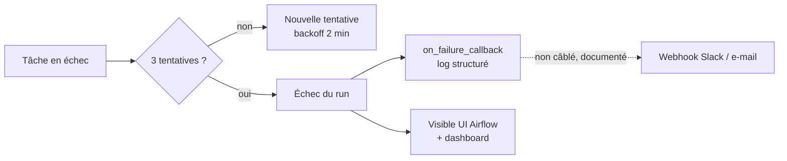

# Plan de monitoring du pipeline — CheckIt.AI

**Livrable de l'étape 5** (avec le tableau de bord Streamlit). Principe directeur :
chaque affirmation de ce plan correspond à un mécanisme **réellement présent dans le
code** — la colonne « Statut » distingue ce qui est *appliqué automatiquement* de ce
qui est *observé* (visible mais sans action automatique) et de ce qui est *documenté
non câblé* (assumé comme tel).

## 1. Seuils d'alerte

| Indicateur | Seuil | Action | Statut |
|---|---|---|---|
| Taux de validité (`valid_rate`) | < 50 % | **Arrêt du chargement** : la tâche `quality_gate` lève une exception, le DAG échoue avant toute écriture en base | ✅ Appliqué (`checkit/load.py::quality_gate`, tâche dédiée du DAG) |
| Taux d'appariement déclaré | < 70 % | Vigilance — visible en carte KPI et courbe historique avec ligne de seuil | 👁 Observé (dashboard) |
| Lignes chargées au run quotidien | 0 pendant 3 runs consécutifs | Suspicion de panne d'extraction (quota, source morte) — vérifier les logs des extracteurs | 👁 Observé (carte « Publications chargées » + table des runs) |
| Échec de tâche Airflow | 1 échec | 3 tentatives espacées (backoff 2 min), puis échec du run, visible UI + callback | ✅ Appliqué (`retries=3` par défaut sur tous les DAGs) |
| Durée du run quotidien | > 1 h | Interruption du run | ✅ Appliqué (`dagrun_timeout=1h`) |
| Doublons (`dup_removed_*`) | tendance croissante anormale | Suspicion de re-collecte involontaire — contrôler les fenêtres d'extraction | 👁 Observé (table des runs) |

## 2. Gestion des erreurs

- **Par tâche** : `retries=3`, backoff exponentiel ; les erreurs réseau sont en outre
  retentées au niveau HTTP (tenacity, 3 tentatives, jamais sur des 4xx).
- **Par source** : une source défaillante n'interrompt pas les autres (motif
  *skip-and-log* : clé absente, flux mort, WAF — comptés et journalisés, jamais fatals).
- **Par enregistrement** : enveloppe `safe-per-record` — un enregistrement malformé
  est compté dans `validation_errors`, jamais bloquant.
- **Porte de qualité** : seule défense *bloquante* — aucune écriture en base si la
  qualité globale s'effondre (< 50 % de validité).
- **Alerting** : `on_failure_callback` consigne un message structuré dans les logs.
  **Câblage Slack/e-mail volontairement non réalisé** dans cette démo locale — le
  point d'accroche existe et le branchement (webhook) est documenté ci-dessous.

## 3. Fréquences de vérification

| Vérification | Fréquence | Moyen |
|---|---|---|
| Santé des runs planifiés | quotidienne (jour ouvré) | UI Airflow (port 8081) — pastilles des 3 DAGs |
| KPIs qualité (validité, appariement) | à chaque consultation, cache 5 min | Dashboard Streamlit (port 8501) |
| Quotas APIs (crédits/jour) | hebdomadaire | comptes fournisseurs + `docs/rate-limits.md` |
| Pourrissement des liens images (FakeNewsNet) | mensuelle | re-exécution du criblage (`--screen-images`) et comparaison du taux |
| Espace disque `/data/files/OC12` | mensuelle | `df -h /data` (corpus ~11 Go, croissance lente) |
| Rafraîchissement des verdicts fact-checking | automatique hebdomadaire | DAG `checkit_factcheck_weekly` |

## 4. Cohérence avec l'automatisation (exigence du brief)

Le plan ne promet rien que les DAGs ne fassent : les seuils « appliqués » vivent dans
le code testé (porte de qualité, retries, timeout) ; les seuils « observés » sont
affichés par le dashboard qui lit `pipeline_metrics`, table alimentée à chaque run
par la tâche de chargement — il n'existe aucun indicateur affiché qui ne soit pas
réellement mesuré.

## 5. Évolutions (hors périmètre démo, identifiées)

Webhook Slack réel sur `on_failure_callback` · alerte automatique sur appariement
< 70 % · export Prometheus + Grafana si le pipeline passait en production ·
Deadline Alerts Airflow 3 pour les SLA par tâche (l'ancien paramètre `sla=` a été
retiré d'Airflow 3).
