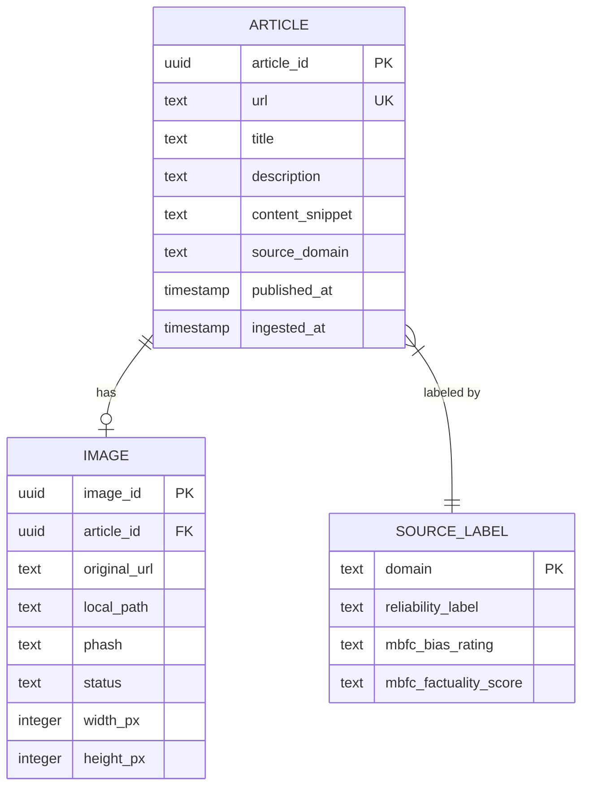

# OC12 — Project Strategy

*A concrete, opinionated roadmap for building a multimodal (text + image) fake-news data pipeline as a junior data engineer, optimised for strong evaluation marks.*

---

## 1. Scoping: minimal viable source vs. multiple sources

### Recommendation: one primary source, one optional enrichment layer

For a junior-level training project, **start with a single well-understood, legally clean source and build it right, rather than integrating many sources poorly**. The evaluator will reward depth, modularity, and reproducibility over breadth.

**Primary recommended source: NewsAPI.org** (developer/free tier) combined with a **source reliability label map from MBFC (Media Bias/Fact Check)**.

Rationale:

- NewsAPI returns structured JSON with `title`, `description`, `content` (truncated), `url`, `urlToImage`, `publishedAt`, `source.name` per article. The `urlToImage` field gives you the multimodal pairing (article text ↔ associated image) out of the box, without any scraping.
- It has an official Python client (`newsapi-python`), clean REST semantics, and 100 requests/day on the free tier — sufficient to collect hundreds of articles per run during development.
- Legal position: the Developer plan explicitly covers development and testing. Data is pulled from licensed publishers. You are consuming article metadata + image URLs, not reproducing full copyrighted text. This is the clearest legal footing available at zero cost.
- MBFC provides free, publicly referenced source-level reliability ratings (unreliable / mixed / reliable) that map directly to your source domain. This avoids manual article-by-article labelling while giving you a defensible label quality story.

**What to avoid at this stage:**

| Candidate | Problem |
|---|---|
| Web scraping (BeautifulSoup / Scrapy) | High maintenance, robots.txt / ToS violations, fragile selectors, evaluator explicitly dislikes it |
| GDELT | Does not return full text or image URLs directly; requires chaining to external HTML fetches, BigQuery costs, and re-scraping — all complexity with no label signal |
| Reddit / Fakeddit | Useful benchmark dataset but the Reddit API has changed pricing dramatically (2023+); replicating data collection is fraught |
| NewsData.io | Free tier does not expose full article content; unclear image URL field availability |

**Optional enrichment (step 2 only, after MVP works):** Once the base pipeline is stable, you can join your collected articles against the NELA-GT SQLite export (available on Harvard Dataverse, CC-BY licence) to verify or augment reliability labels. Do not build this dependency in from the start.

---

## 2. Target architecture

### 2.1 Component map

```
┌─────────────────────────────────────────────────────────────┐
│                         Orchestration                        │
│                    Apache Airflow (local)                    │
│            DAG: news_pipeline_dag (daily schedule)          │
└────────────────────────────┬────────────────────────────────┘
                             │
         ┌───────────────────▼────────────────────┐
         │            EXTRACT layer                │
         │  extractor/newsapi_client.py            │
         │  · NewsAPI /everything endpoint         │
         │  · Keyword list: configurable           │
         │  · Output: raw JSON files               │
         │  extractor/image_downloader.py          │
         │  · Fetches urlToImage → local file      │
         │  · Saves to raw/images/{date}/{hash}.jpg│
         └───────────────────┬────────────────────┘
                             │
         ┌───────────────────▼────────────────────┐
         │           TRANSFORM layer               │
         │  transformer/cleaner.py                 │
         │  · Deduplicate by URL hash              │
         │  · Normalise text (strip HTML, length)  │
         │  transformer/label_mapper.py            │
         │  · Join source domain → MBFC label      │
         │  transformer/image_validator.py         │
         │  · Check image downloaded OK            │
         │  · Compute pHash for deduplication      │
         │  · Verify image linked to article       │
         │  transformer/schema_builder.py          │
         │  · Produce validated Article records    │
         └───────────────────┬────────────────────┘
                             │
         ┌───────────────────▼────────────────────┐
         │              LOAD layer                 │
         │  loader/postgres_loader.py              │
         │  · Upsert into articles table           │
         │  · COPY or executemany for batch        │
         └───────────────────┬────────────────────┘
                             │
         ┌───────────────────▼────────────────────┐
         │             STORAGE layer               │
         │  PostgreSQL (Docker, local)             │
         │  · articles table (metadata + labels)   │
         │  · images table (path, hash, status)    │
         │  File system / MinIO (optional)         │
         │  · raw/json/{date}/batch_{n}.json       │
         │  · raw/images/{date}/{url_hash}.jpg     │
         └───────────────────┬────────────────────┘
                             │
         ┌───────────────────▼────────────────────┐
         │           MONITORING layer              │
         │  Streamlit dashboard                    │
         │  · Articles collected / day             │
         │  · Label distribution (pie chart)       │
         │  · Image download success rate          │
         │  · Duplicate rate                       │
         │  · Source breakdown                     │
         └────────────────────────────────────────┘
```

### 2.2 Multimodal storage: image bytes vs. URLs vs. both

**Decision: store both the original URL and a locally downloaded copy, with the path stored in the database.**

Reasoning:

- URLs alone are **not durable** for an ML dataset: news sites delete or rotate images, CDNs expire. If a model is trained months later on URL-only data, a large fraction of images will return 404.
- Storing raw bytes in PostgreSQL (BYTEA column) **bloats the DB, makes backups painful, and prevents efficient file-system-level access** by ML training loops (which expect directory structures).
- Best practice: **store image files on disk (or MinIO for production parity)** in a structured directory tree, and store the relative file path + SHA256 hash in PostgreSQL. This decouples storage from query.

```
data/
├── raw/
│   ├── json/
│   │   └── 2025-05-29/
│   │       └── batch_001.json
│   └── images/
│       └── 2025-05-29/
│           └── a3f9b2c1.jpg    ← named by URL SHA256[:8]
└── processed/
    └── articles_2025-05-29.parquet  ← transformed snapshot
```

PostgreSQL keeps: `article_id`, `url`, `title`, `description`, `source_domain`, `reliability_label`, `published_at`, `image_url` (original), `image_local_path` (relative), `image_hash` (pHash), `image_status` (`ok` / `missing` / `error`).

If you want to show MinIO competence (not required but impressive): run a local MinIO container, upload the image directory, and store the MinIO object key in the DB instead of a file path. The `boto3` / `minio` Python SDK makes this straightforward.

---

## 3. Roadmap mapped to the 5 deliverables

### Deliverable 1 — Source exploration report (this document + supplementary research)

**Goal:** Choose source, validate legal standing, profile available fields, assess label strategy.

**Steps:**
1. Register a NewsAPI developer key. Test the `/everything` endpoint with a few keywords.
2. Download and inspect the MBFC dataset (available as CSV from GitHub, e.g., [`ramybaly/News-Media-Reliability`](https://github.com/ramybaly/News-Media-Reliability)).
3. Verify `urlToImage` fill rate: run a 50-article sample and count non-null image URLs.
4. Document the field schema in a table.

**Risk:** Low fill rate for `urlToImage` (some sources don't provide OG images). **De-risk:** Filter queries to sources known to publish images (major outlets); record fill rate as a KPI.

**Risk:** MBFC coverage of source domains in your corpus may be incomplete. **De-risk:** Any unmatched domain gets label `unknown`, never `reliable` — conservative by default.

---

### Deliverable 2 — Automated extraction scripts

**Goal:** Modular Python package with CLI entry points, parameterisable via config file.

**Module layout:**

```
pipeline/
├── config.py           # Pydantic settings, reads from .env
├── extractor/
│   ├── __init__.py
│   ├── newsapi_client.py      # Thin wrapper over newsapi-python
│   └── image_downloader.py   # requests + retry + timeout
├── transformer/
│   ├── cleaner.py             # text normalisation
│   ├── label_mapper.py        # domain → MBFC label
│   ├── image_validator.py     # download check, pHash
│   └── schema_builder.py      # output: ArticleRecord dataclass
├── loader/
│   └── postgres_loader.py     # SQLAlchemy or psycopg2
├── utils/
│   ├── logging_config.py      # structured logging, JSON format
│   └── retry.py               # exponential backoff decorator
└── tests/
    ├── test_cleaner.py
    ├── test_label_mapper.py
    └── fixtures/sample_api_response.json
```

**Key implementation decisions:**
- Use `python-dotenv` / Pydantic `BaseSettings` for all secrets (API key, DB DSN). Never hardcode.
- Every function has a return type annotation and a docstring.
- Logging: use Python `logging` with a structured formatter. Log at `DEBUG` for extraction details, `INFO` for batch summaries, `WARNING` for partial failures (image download failed), `ERROR` for hard failures.
- Retry logic (exponential backoff, 3 attempts) around all network calls.
- The image downloader must validate that the HTTP response Content-Type is `image/*` before saving.

**Risk:** NewsAPI returns a 426 error when the free tier is exceeded. **De-risk:** Wrap all API calls to catch `NewsAPIException`, log with count of requests used, and halt gracefully with a descriptive error.

---

### Deliverable 3 — Transformation pipeline + data schema

**Goal:** Reproducible Pandas/Polars transformation pipeline; conceptual data schema diagram.

**Transformation steps (logged, idempotent):**
1. Load raw JSON batch.
2. Deduplicate by `url` hash (keep first seen).
3. Strip HTML from `content` field (use `BeautifulSoup` or `html.parser`).
4. Normalise `published_at` to UTC ISO-8601.
5. Join `source.name` domain to MBFC label CSV.
6. Download image (if not already in local cache by URL hash).
7. Compute pHash of downloaded image; flag duplicate images.
8. Validate text-image pairing: mark `paired_ok = True` only when both text (`title` + `description` non-empty) and image (`image_status == 'ok'`) are present.
9. Write to processed Parquet snapshot.

**Conceptual data schema (Mermaid):**



**Risk:** The Mermaid diagram conflates conceptual and physical. **De-risk:** Label the diagram "Conceptual schema — not a physical DDL" and provide the actual `CREATE TABLE` statements separately in a `schema.sql` file.

---

### Deliverable 4 — Airflow ETL DAG

**Goal:** A working `news_pipeline_dag.py` that runs the full pipeline on a schedule, visible in the Airflow UI.

**DAG structure:**

```
start
  │
  ▼
extract_articles   (PythonOperator → newsapi_client.fetch_batch)
  │
  ▼
download_images    (PythonOperator → image_downloader.download_batch)
  │
  ▼
transform_and_label  (PythonOperator → transformer pipeline)
  │
  ▼
load_to_postgres   (PythonOperator → postgres_loader.upsert_batch)
  │
  ▼
update_pipeline_stats  (PythonOperator → write KPI row to stats table)
  │
  ▼
end
```

**Local setup (Docker Compose):**

```yaml
services:
  postgres:
    image: postgres:16
  airflow-webserver:
    image: apache/airflow:2.9.0
  airflow-scheduler:
    image: apache/airflow:2.9.0
  minio:            # optional, for image object storage demo
    image: minio/minio
```

**Key DAG implementation notes:**
- Use `catchup=False` and `max_active_runs=1` to avoid quota exhaustion.
- Pass data between tasks via XCom for small payloads (batch IDs, counts) and file paths for large payloads (raw JSON). Do not pass full article content through XCom.
- Each task should be **idempotent**: running the same execution date twice should not insert duplicates (use `ON CONFLICT DO NOTHING` in SQL).
- Add `on_failure_callback` to log the failing task to the `pipeline_stats` table — this feeds your Streamlit monitoring.

**Risk:** Airflow version conflicts in Docker. **De-risk:** Pin all image versions in `docker-compose.yml` and `requirements.txt`. Document the exact `docker compose up` command in `README.md`.

**Risk:** NewsAPI quota exhausted mid-DAG. **De-risk:** The `extract_articles` task checks remaining quota before calling and skips gracefully, writing `quota_exhausted` to `pipeline_stats`.

---

### Deliverable 5 — Streamlit dashboard + monitoring plan

**Goal:** A single-page Streamlit app that queries PostgreSQL and shows pipeline health and dataset quality at a glance.

**KPI panels (suggested layout):**

| Panel | Metric | Chart type |
|---|---|---|
| Collection | Articles collected / day | Line chart |
| Labels | Reliable / Mixed / Unreliable / Unknown distribution | Pie chart |
| Images | Image download success rate (%) | Gauge / metric |
| Pairing | `paired_ok` rate (both text + image present) | Metric |
| Duplicates | Duplicate URL rate | Metric |
| Sources | Top 10 source domains | Bar chart |
| Pipeline | Last DAG run status + duration | Table |

**Monitoring plan (not just a dashboard):**

- **Alerting threshold:** if `paired_ok` rate drops below 80% in a day's run, flag the run as degraded.
- **Data drift signal:** track average article title length over time — a sudden drop may indicate the API is returning empty titles (rate limit or parsing issue).
- **Weekly report:** one email / Slack message summarising: articles this week, label balance, any failed DAG runs. (Can be a stub in the project — describe the mechanism even if not fully wired.)

**Risk:** Streamlit app has no auth, exposing DB credentials via query string. **De-risk:** Read DB DSN from `.env`, never from URL parameters. Document this in a security note.

---

## 4. What "good" looks like (implicit rubric)

| Criterion | Weak | Strong |
|---|---|---|
| **Modularity** | One monolithic script | Separate `extractor/`, `transformer/`, `loader/` packages with clear interfaces |
| **Reproducibility** | Works on my machine | `docker compose up` brings up the full stack; `README.md` has exact commands; `requirements.txt` pinned |
| **Logging** | Print statements | Python `logging` with levels, timestamped, persisted to file; pipeline stats table in DB |
| **Error handling** | Script crashes on any error | Try/except at every I/O call; graceful degradation; partial failures logged, not fatal |
| **Legality** | Unclear | Documented: API ToS link, image download policy, label source citation |
| **Label quality** | No label or self-invented | Source-level MBFC reliability rating, explained in report, limitations acknowledged |
| **Data schema** | No diagram | Mermaid ERD in report + `schema.sql` DDL + validation logic in code |
| **Airflow DAG** | DAG file but not running | DAG runs green in local Airflow UI; screenshot in report |
| **Dashboard** | Static plot | Streamlit app reads live from DB; KPIs update on refresh |
| **Multimodal pairing integrity** | Images stored but not verified | `paired_ok` flag; pHash deduplication; image_status tracked per article |

**Concrete success criteria:**
- `docker compose up` → Airflow UI reachable → manual DAG trigger → DAG completes green in < 5 min.
- PostgreSQL `articles` table has ≥ 200 rows with `image_local_path IS NOT NULL` after one week of runs.
- `paired_ok` rate ≥ 75% of collected articles.
- Streamlit dashboard shows correct KPI counts matching DB state.
- `pytest tests/ -v` passes with ≥ 10 unit tests covering transformation logic.

---

## 5. Recommendations specific to the fake-news multimodal use case

**Label quality is the single most important design decision.** A dataset with high-quality source-level labels and moderate size is more valuable to downstream ML than a large dataset with noisy or undefined labels. Use MBFC factuality scores as your primary label. Acknowledge the limitation: source-level labels mean every article from a "reliable" outlet is labelled reliable, even if one specific article is false. This is called "distant supervision" — name it, explain it, don't hide it.

**Balance the label distribution.** Reliable sources vastly outnumber unreliable ones in the real world. For ML utility, aim for a roughly balanced corpus: filter queries to include known unreliable sources (e.g., search keywords popular on conspiracy sites) alongside mainstream queries. Document your sampling strategy.

**Deduplication at two levels:**
1. **URL deduplication** (SQL `UNIQUE` constraint on `url`) — prevents duplicate articles from repeated API calls.
2. **Image perceptual hash deduplication** — many news sites reuse the same stock photos. pHash (`imagehash` Python library) with Hamming distance ≤ 10 catches near-duplicates. Flag them; don't necessarily delete, but note in the schema.

**Text-image pairing integrity.** The `urlToImage` from NewsAPI is the article's Open Graph image — it is the image the publisher chose to associate with the article. This is the strongest pairing signal available without scraping. Still validate:
- Image URL is not a generic logo or placeholder (heuristic: image size < 5KB → suspect).
- Image downloads successfully (HTTP 200, Content-Type: image/*).
- Record `paired_ok = (text_ok AND image_ok)` per article.

**Separate "controversial opinion" from "disinformation."** Your label is source reliability (factuality), not political bias. MBFC rates sources on a factuality axis (0–5) independently from a left-right bias axis. Use only the factuality axis. A source can be politically biased but factually accurate (many mainstream outlets); only low factuality maps to potential disinformation. Document this distinction prominently in Deliverable 1 to pre-empt evaluator concerns.

---

## 6. Pitfalls to avoid

**API quota exhaustion.** NewsAPI free tier: 100 requests/day, 24-hour delay on articles. Plan your DAG schedule around this. A daily DAG pulling 100 requests × up to 100 articles/request = up to 10,000 articles/day theoretical maximum; in practice, 500-1,000 usable articles/day is realistic. Add a `RateLimiter` in the extractor.

**Scraping legality.** Do not scrape full article bodies from publisher sites. NewsAPI returns a `content` field that is deliberately truncated (to ~200 chars) to protect publishers' rights. For this project, `title` + `description` (usually 200-400 chars total) is sufficient as the text modality. Do not attempt to fetch and parse the full article HTML.

**Orphan images.** An image downloaded without a linked article in the DB is waste. Always insert the article record first; download the image after; link via `article_id`. Use a database transaction or write the path back to the article row immediately.

**Conflating conceptual schema and physical schema.** The Mermaid ERD is a conceptual model. The `CREATE TABLE` DDL is the physical schema. Do not mix them. The evaluator will notice if your Mermaid diagram has columns that don't match your actual SQL.

**Opinion ≠ disinformation.** This is the most common conceptual error in fake-news projects. An article expressing a strong right-wing or left-wing opinion is not disinformation unless it contains objectively false factual claims. MBFC's "factuality" score (not bias score) is what you want. Spell this out in your source exploration report.

**Schema confusion: article URL vs. image URL.** Keep `url` (article page) and `image_url` (associated image) as separate columns from the start. Many projects accidentally use article URL as image key and break later.

**Docker Compose version drift.** Pin `apache/airflow:2.9.0` (or the latest stable at the time you start), not `latest`. Airflow has breaking changes between minor versions.

**Not testing the transform layer.** Transformation logic (label mapping, deduplication, pHash validation) is the most likely place to introduce silent bugs. Write unit tests for edge cases: missing image URL, unmapped domain, HTML in title field.

---

## Key recommendations

- **Use NewsAPI.org as the single primary source**: it provides native text+image URL pairing, has an official Python client, clear ToS for development use, and zero cost.
- **Label at source level using MBFC**: source-level reliability is defensible, well-documented, and reproducible; name the distant supervision limitation explicitly.
- **Store images as files + path in DB, not bytes in DB**: use a `data/raw/images/{date}/{hash}.jpg` layout; optionally demo MinIO for production parity.
- **Build modular Python packages** (`extractor/`, `transformer/`, `loader/`) with a Pydantic config layer — this is the single biggest lever on the modularity score.
- **Make the pipeline idempotent**: every task in the Airflow DAG must be safe to re-run; use `ON CONFLICT DO NOTHING` and URL-hash deduplication.
- **Track `paired_ok` as a first-class KPI**: it is the clearest signal of multimodal dataset quality and will impress evaluators who understand the use case.
- **Distinguish factuality from bias** and document it in Deliverable 1 — this shows conceptual maturity that most junior submissions miss.
- **Pin all Docker image versions** and provide a one-command bootstrap (`docker compose up`) — reproducibility is evaluated, not assumed.
- **Write ≥ 10 unit tests** covering at least the label mapper and text cleaner — tests are cheap to write and directly signal engineering rigour.

---

## Sources

- [NewsAPI.org Pricing & Developer Plan](https://newsapi.org/pricing)
- [NewsAPI.org Documentation — /everything endpoint](https://newsapi.org/docs/endpoints/everything)
- [GDELT Project — Data Overview](https://www.gdeltproject.org/data.html)
- [GDELT DOC 2.0 API (Visual Global Knowledge Graph)](https://blog.gdeltproject.org/gdelt-doc-2-0-api-debuts/)
- [GDELT for News Data 2026 — Comparison with NewsAPI](https://dataresearchtools.com/gdelt-project-for-news-data-2026-free-alternative-to-newsapi/)
- [Media Bias/Fact Check — Wikipedia overview](https://en.wikipedia.org/wiki/Media_Bias/Fact_Check)
- [News-Media-Reliability GitHub (MBFC dataset)](https://github.com/ramybaly/News-Media-Reliability)
- [NELA-GT-2022 — Large Multi-Labelled News Dataset (arXiv)](https://arxiv.org/pdf/2203.05659)
- [NELA-GT-2020 (arXiv)](https://arxiv.org/pdf/2102.04567)
- [Fakeddit: A New Multimodal Benchmark Dataset (arXiv)](https://arxiv.org/abs/1911.03854)
- [MM-COVID: Multilingual and Multimodal COVID Disinformation Dataset (arXiv)](https://arxiv.org/pdf/2011.04088)
- [ReCOVery: Multimodal Repository for COVID-19 News Credibility (arXiv)](https://arxiv.org/pdf/2006.05557)
- [BERT-Based Multimodal Fake News Detection (MDPI, 2025)](https://www.mdpi.com/2073-431X/14/6/237)
- [Text-image multimodal fusion for fake news detection (Sage Journals, 2024)](https://journals.sagepub.com/doi/10.1177/00368504241292685)
- [ETL Pipeline with Airflow and PostgreSQL (Medium)](https://medium.com/@mohamed.h.eltedawy/etl-data-pipeline-with-airflow-and-postgresql-c9d40f8abf03)
- [ETL Pipelines with Polars, MinIO, Postgres, and Airflow (Medium)](https://jasonjimenezcruz.medium.com/practice-etl-pipelines-with-polars-minio-postgres-and-airflow-9ccac4eae736)
- [MinIO — S3-Compatible Object Storage (GitHub)](https://github.com/minio/minio)
- [Airflow ETL Best Practices (Astronomer)](https://www.astronomer.io/ebooks/apache-airflow-3-best-practices-etl-elt-pipelines/)
- [Python for ETL Pipelines — Modular, Testable Workflows (Medium)](https://medium.com/@CodeWithHannan/python-for-etl-pipelines-building-modular-testable-and-reliable-data-workflows-0f1768428244)
- [Comparative Evaluation of Perceptual Hashing for Image Deduplication (MDPI, 2026)](https://www.mdpi.com/2079-9292/15/7/1493)
- [Building KPI Dashboard in Streamlit (Medium)](https://medium.com/@cameronjosephjones/building-a-kpi-dashboard-in-streamlit-using-python-c88ac63903f5)
- [Automated News Intelligence Pipeline (Data Project Hunt)](https://www.dataprojecthunt.com/project/79c792ac-472f-451a-a9d2-8ffbe10fa9a9)
