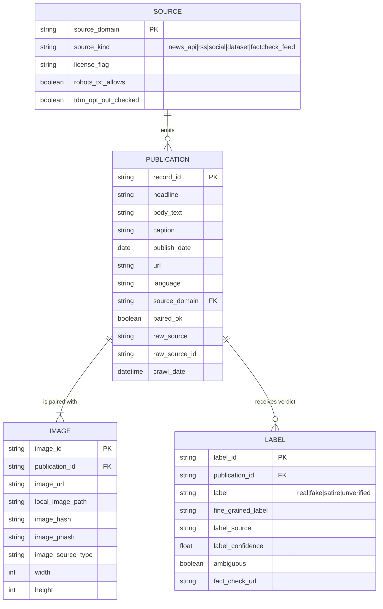

# OC12 — Implementation Blueprint

*CheckIt.AI multimodal fake-news data pipeline. This is the decision document the user reads to arbitrate every implementation choice before autonomous development starts. It synthesises the five preliminary research reports (01–05), the live source-verification sweep (2026-06-05), the per-step delivery analyses, the field dictionary, and the architecture decisions into one place.*

*Date: 2026-06-05. Framing: NON-COMMERCIAL graded exercise / demo. Rights judged on the BINDING document (ToS / LICENSE / robots.txt), never marketing.*

> **Relationship to `00-SUMMARY.md`:** this blueprint **supersedes** the May-2026 summary on several load-bearing points where the live verification and 2026 reality changed the answer. Every such divergence is tagged **[SUPERSEDES 00-SUMMARY]** inline. The most important: **Airflow 3.2.x not 2.10**; **NewsData.io commercial rights are NOT verified** (ToS unreadable); **pandas 2.2.x not 3.0**; **psycopg3 not psycopg2**; **fast-langdetect/lingua not langdetect**; **Pillow 12 not 11**.

---

## 1. Executive summary

Build one `uv`-managed monorepo (`checkit/` package + `dags/` + `dashboard/`), Python 3.12, delivering the five graded steps as a single coherent chain. The spine recommendation is **Option C-lite hybrid**: a **live source** the Airflow DAG runs daily (NewsData.io API *or*, preferably for clean rights, GDELT DOC 2.0) **+ an RSS source** (`feedparser`) for no-key resilience **+ one labeled corpus** (DGM4 or Fakeddit) for the real-label / training story. Pairing integrity (text AND a Pillow-validated image in the same record) is the headline, measured property, gated *before* every write. Raw lands as JSONL, clean as Parquet + a CSV index; images stored as local files referenced by path+SHA256+pHash, never as DB blobs and never redistributed. PostgreSQL 16 (dedicated container, `scram-sha-256`, `etl_writer`/`dashboard_reader` roles, pgcrypto) is the secured store; Airflow 3.2.2 via Astro CLI orchestrates three thin tasks (extract→transform→load) that delegate to the package. Streamlit 1.58 reads `pipeline_metrics` for the three KPI axes (précision/rapidité/coût). The single highest-leverage open decision is still the **spine (A/B/C)** and the **legal comfort level on NewsData.io's unreadable ToS** — both are the user's call and drive everything downstream.

---

## 2. Per-step delivery plan

### Step 1 — Source exploration report (Markdown, French)

| Aspect | Spec |
|---|---|
| **Artifact** | `deliverables/step1/01-rapport-exploration-sources.md` — single Markdown report (brief allows MD or PDF; write MD, export PDF later only if asked) |
| **Format** | ~6–9 sections: contexte/objectif · méthodologie (5 axes) · tableau comparatif · fiches par source retenue · cas typiques (Wardle) · champs indispensables · format de sortie · opinion-vs-désinformation · synthèse + shortlist |
| **Content** | Qualify **4–5** sources fully (≥3 required, "plus étant mieux"). Each scored on: modalité appariée (oui/non) · format · langue · qualité des labels **+ source du label nommée** · droits d'usage **avec clause contraignante citée + date** · méthode d'extraction (API REST / Scrapy / Selenium / feedparser). Include the indispensable-fields table, the `paired_ok` concept as a first-class measured field, the JSONL+Parquet output decision, and the explicit opinion/satire/désinformation rule (factuality axis only). |
| **Graded criteria** | ≥3 genuinely paired sources; all axes covered; rights AND label reliability both verified (human fact-checker vs distant supervision vs none differentiated); official channels first / RSS not forgotten; indispensable fields enumerated; pairing verification explicit; output format justified; opinion≠satire≠disinfo correct; Wardle archetypes present; report self-contained and consistent with Steps 2–5 |
| **Traps defused** | Don't list non-paired sources (GDELT GKG bare CSV / LIAR / NewsBag) as multimodal — put them in an "écartées et pourquoi" note; never fold satire into "fake"; never confuse controversial opinion with disinfo; **never assert NewsData.io "commercial OK"** (ToS unreadable → "à vérifier sur le document contraignant", lean on demo framing); "publicly accessible" ≠ "free to reuse" (Fakeddit/FakeNewsNet have NO license file → store URL+hash, not raw images); flag FakeNewsNet needs Twitter/X creds; distant-supervision labels marked lower-confidence; don't build the cleaning pipeline here (that's Step 3) |
| **Stack** | Hand-authored Markdown; WebFetch/WebSearch + `urllib.robotparser` for binding-rights checks at write time; a ~15-line throwaway `requests` probe to confirm `image_url` fill-rate on a live sample; output decision JSONL (raw) + Parquet (clean) via pyarrow |

### Step 2 — Automated extraction scripts (Python package + tests)

| Aspect | Spec |
|---|---|
| **Artifact** | `checkit/extract/` modular package + `tests/` + a short feasibility probe note (embedded in README, not a standalone .md) |
| **Format** | `.py` modules, src layout, Python 3.12, `uv`/`pyproject.toml`. One CLI: `python -m checkit.extract --source newsdata --query '...' --max-credits 50 --lang fr` |
| **Content (modules)** | `config.py` (pydantic-settings, `SecretStr`) · `logging_config.py` (JSON formatter) · `extract/newsdata_client.py` (connexion+parsing, `newsdataapi` SDK or `requests`+`tenacity` fallback, 429/Retry-After, `max_credits_per_run` guard) · `extract/image_downloader.py` (Content-Type + Pillow `verify()` + size cap → `data/raw/images/{run_date}/{sha256[:12]}.{ext}`) · `extract/rss_source.py` (`feedparser` + image cascade media_content→thumbnail→enclosure→content ``→og:image) · `parsing.py` (one flat raw schema) · `pairing.py` (`is_valid_pair`, light clean) · `storage.py` (atomic JSONL append) · `run_extract.py` (CLI, end-of-run counts summary) · `.env.example` |
| **Graded criteria** | Modularity along connexion/parsing/nettoyage/sauvegarde; unattended one-command run; configurable params via .env/CLI; structured logs (not print); try/except on every I/O; quota guard + key from env + 429 honored; image-link exploitability checked (Content-Type+format+accessibility); JSON/HTML feasibility tested; **pairing enforced before write**; scraping legality (robots+ToS); code defensible at mentor session |
| **Traps defused** | Never persist unpaired records (gate runs before write, skipped counted+logged); `image_url` present ≠ image exists (download+verify); free-tier self-DoS (200 credits/day, 30/15min, 12h delay, 100-char query cap → explicit cap, log `quota_reached` not crash); never hardcode/commit key; wire **≥2 extractors** (API + RSS) so demo isn't single-source-fragile; prefer `.py` package over notebook; per-record safe wrapper re-raises `KeyboardInterrupt`; keep heavy normalization for Step 3; **extractor functions stay pure (no Airflow imports)**; don't scrape opt-out FR publisher bodies (TDM Art.4 / STAD) |
| **Stack** | `newsdataapi` SDK · `requests`+`tenacity` · `feedparser`+`beautifulsoup4(lxml)`+`trafilatura` · `Pillow`+`hashlib` · `pydantic-settings`+`SecretStr` · stdlib `logging` JSON · `pytest`+`responses` (hermetic, ≥8 tests) · JSONL output |

### Step 3 — Transformation pipeline + conceptual schema (two deliverables)

| Aspect | Spec |
|---|---|
| **Artifacts** | (A) `checkit/transform/` package + CLI; (B) `transform.log` / RunReport JSON; (C) `docs/conceptual_schema.md` + `.mmd` (Mermaid ERD + field dictionary) |
| **Format** | `python -m checkit.transform --in data/raw/*.jsonl --out data/processed/dataset.parquet`. Stages = **lecture / traitement / export** as named modules |
| **Content** | `io_read.py` (`read_raw`, never mutate raw/) · `clean.py` (`nettoie_texte` NFKC+whitespace+trafilatura, `normalize_date`, `normalize_domain`, `detect_language`) · `validate.py` (`valide_image` Pillow.verify+Content-Type+size, `is_valid_pair`, `text_fingerprint` SHA-256, `image_phash` Hamming<10) · `mapping.py` (`map_record` → `CleanRecord`, derived cols: `record_id` UUID5, `image_hash`, `paired_ok`, `language`, `label_confidence` default by source, `ambiguous`) · `pipeline.py` (orchestrate, `safe_record` log+skip, per-stage drop counts) · export Parquet + CSV index. Conceptual ERD: 4 entities (PUBLICATION/IMAGE/LABEL/SOURCE) with crow's-foot cardinality, typed attributes, **per-field role in the AI use case** |
| **Graded criteria** | Conceptual model is NOT physical SQL (entities/relations/business meaning, no CREATE TABLE); modular lecture/traitement/export with small named functions; reproducible + journaled via stdlib `Logging`; pairing verified not assumed; exploration not re-done (consumes raw only, no fetch); fields carry types AND AI-use-case role; derived columns present+justified; diagram via Mermaid/draw.io; code explainable |
| **Traps defused** | Don't deliver physical DDL as conceptual model (highest-weight trap); don't re-fetch inside transform; pairing requires image to actually load; log every drop with reason code; deterministic output (UUID5 not UUID4, sort by record_id, no wall-clock in data); keep satire distinct + store fine_grained_label; ship `.py` not only `.ipynb`; use trafilatura not fragile regex; keep legal/provenance fields; **pin pandas 2.2.x not 3.0** [SUPERSEDES step-3 analysis] |
| **Stack** | Python 3.12 + stdlib `logging` JSON · Mermaid erDiagram · `trafilatura` 2.x + BeautifulSoup/lxml · `Pillow` 12.x + `ImageHash` · **pandas 2.2.x + pyarrow** · pydantic v2 (single `CleanRecord` model feeds code + doc) · `pytest`+`responses` · **`fast-langdetect`/`lingua` NOT `langdetect`** [SUPERSEDES report 05] |

### Step 4 — Airflow ETL → secured PostgreSQL (DAG + DDL + compose + run evidence)

| Aspect | Spec |
|---|---|
| **Artifacts** | `dags/fakenews_etl_dag.py` · `db/schema.sql` · `docker-compose.yml` (or Astro project) · `docs/STEP4_RUN_EVIDENCE.md` · pinned `requirements.txt` + README |
| **Format** | Airflow **3.2.2** TaskFlow (`from airflow.sdk import dag, task`). One DAG `fakenews_etl`, 3–4 tasks extract→transform→load (+ optional validate gate). PostgreSQL 16 in a **dedicated** app container |
| **Content** | `@dag(schedule='@daily', start_date=datetime(2025,1,1), catchup=False, max_active_runs=1, dagrun_timeout=2h, default_args={retries:2, retry_exponential_backoff:True})`. Three thin `@task` wrappers delegating to `checkit.extract`/`checkit.transform`/`checkit.db`. XCom carries **only path strings**. Data-quality gate raises `ValueError` if valid-rate < 0.5. DB creds from Airflow Connection `postgres_fakenews` via `PostgresHook`. `load()` does `INSERT … ON CONFLICT (url) DO NOTHING` then writes one `pipeline_metrics` row. `logging.getLogger(__name__)` per task; `on_failure_callback` stub. `schema.sql`: `articles` (UNIQUE(url), JSONB extras, image path/hash not bytes) + `pipeline_metrics`; security block `CREATE ROLE etl_writer` / `dashboard_reader` (least-privilege), `scram-sha-256` in pg_hba, pgcrypto on a sensitive column |
| **Graded criteria** | DAG actually runs end-to-end locally (run evidence mandatory); 3 distinct E/T/L tasks; tasks **reuse** Step 2/3 functions; correct Airflow-3 imports; DB choice justified (SQL vs NoSQL paragraph); secured on all three axes (authn / least-privilege / encryption) with concrete artifacts; modular/unattended/idempotent; logs + UI screenshots + DB rows shown |
| **Traps defused** | **Airflow 3.2.x not 2.10 (2.x EOL 2026-04-22)** [SUPERSEDES report 04]; `airflow.sdk` + `apache-airflow-providers-standard` imports (not `airflow.decorators`/`airflow.operators.python`); fixed past `start_date` not `datetime.now()`; no DataFrames/bytes through XCom; no hardcoded password; connect as `etl_writer` not superuser; app DB separate from Airflow metadata DB; security proven not claimed; idempotent load; no monolithic/BashOperator task; justify SQL not NoSQL; **DAG must be executed, not just parsed** |
| **Stack** | Airflow 3.2.2 via Astro CLI (`astro dev start`; `--standalone` fallback) · TaskFlow `@task` + providers-standard · PostgreSQL 16 + images on FS by path · `apache-airflow-providers-postgres` (PostgresHook) · **`psycopg` (psycopg3) not psycopg2** [SUPERSEDES report 04] · stdlib logging + `pipeline_metrics` row |

### Step 5 — Streamlit KPI dashboard + monitoring plan (two deliverables)

| Aspect | Spec |
|---|---|
| **Artifacts** | `dashboard/pipeline_monitor.py` (Streamlit `.py`, NOT `.ipynb`) · `docs/monitoring_plan.md` (French) · `seed_demo_metrics.py` |
| **Format** | `streamlit run dashboard/pipeline_monitor.py`. Streamlit **1.58.x** (py≥3.10). Reads `pipeline_metrics` via read-only `dashboard_reader` role from `st.secrets`, `@st.cache_data(ttl=300)` |
| **Content** | `st.set_page_config` first; `load_metrics()` with try/except → `st.error`+`st.stop`; empty-state guard; KPI header of 4 `st.metric` cards using 2026 features (`delta=`, `border=True`, `chart_data=` sparkline); health banner (`st.success/warning/error`, flips on valid-rate <80%/<60%); `st.date_input` range filter; 3 charts covering all three axes — line (valid_count vs image_ok_count = **précision**), stacked bar from `task_timings` JSONB (**rapidité**), gauge api_calls_used/quota (**coût**); French UI labels. Monitoring plan sections: KPIs suivis · seuils d'alerte (table, enforced-in-code vs observational) · gestion des erreurs (retries/backoff/timeout/callback, stub vs live) · fréquence des vérifications · Mermaid alert-flow diagram · limites & évolutions |
| **Graded criteria** | All three KPI families present+named; runnable unattended + non-technical-readable (French, big cards, color banner); real `.py` reading the pipeline's own metrics (not hardcoded); plan contains seuils d'alerte + gestion des erreurs + fréquence des vérifications verbatim; plan↔automation coherence; execution evidence; Streamlit-recommended charts (Plotly/Altair/native, not bare matplotlib) |
| **Traps defused** | Ship `.py` not `.ipynb`; never hardcode fake KPIs (read `pipeline_metrics`); never hardcode DB creds (st.secrets + `dashboard_reader`); mark stubbed vs live alerts; **Airflow 3 removed `sla=` → use `dagrun_timeout` + Deadline Alerts** [SUPERSEDES report 04 §5.2]; empty-DB guard prevents traceback; don't over-engineer (Grafana/Prometheus only as "évolutions"); make `coût` concrete (api_calls vs quota, image MB, table size) |
| **Stack** | Streamlit 1.58.x · Plotly (or native `st.line_chart`/`st.bar_chart`) · `st.connection('postgresql', type='sql')` (or SQLAlchemy+psycopg3+`pandas.read_sql`) · Markdown + Mermaid · `pipeline_metrics` + committed sample export as fallback |

---

## 3. Complete source catalogue

All sources swept, grouped by category. **Fit** 0–5 (multimodal pairing usefulness for this mission). **Verified** = was the binding document actually read in the live sweep (yes / no / untested). **N** = new vs already-qualified in the May research. Rights basis cites the binding artifact where read.

### 3.1 News APIs

| Source | Kind | Pairing field | Labels | Lang | Rights basis | Limits | Fit | Verified | N |
|---|---|---|---|---|---|---|---|---|---|
| **NewsData.io** | api | `image_url` (optional/excludable per article) | none (topical only) | 89 | **ToS UNREADABLE (JS SPA)**; only marketing claims commercial — disqualified by hard rule | 200 credits/day, 30/15min, 12h delay, 100-char query, full text gated | 4 | **no** | — |
| Event Registry / NewsAPI.ai | api | `image` (null when absent) | none | multi | not read | key required | 3 | no | — |
| GNews.io | api | `image` | none | multi | not read | free-tier limits | 3 | no | — |
| Currents API | api | `image` ('None' when absent) | none | multi | not read | — | 3 | no | — |
| The Guardian Open Platform | api | `thumbnail`/`show-elements=image` | none (100% verified real-news anchor) | en | not read; key required | thumbnail tiny w/o elements | 3 | no | — |
| Webz.io News API Lite | api | `thumbnail`/`thread.main_image` | none | multi | not read | — | 3 | no | new |
| NYT Article Search | api | `multimedia[]` (relative URLs) | none (real anchor) | en | not read | no full body | 2.5 | no | — |
| NewsAPI.org | api | `urlToImage` | none | multi | not read | 200-char content cap | 2.5 | no | — |
| FreeNewsApi.io | api | `thumbnail` (2-step /details) | none | multi | not read | — | 2.5 | no | new |
| TheNewsAPI | api | `image_url` | none | multi | not read | 60-char snippet | 2 | no | new |
| World News API | api | `image` (+video) | none (sentiment only) | multi | not read | — | 2 | no | — |
| APITube.io | api | image field unconfirmed in docs | none | multi | not read | field name unverified | 2 | no | new |
| mediastack | api | `image` | none | multi | not read | no full body | 1.5 | no | — |

### 3.2 Social APIs

| Source | Kind | Pairing field | Labels | Lang | Rights basis | Limits | Fit | Verified | N |
|---|---|---|---|---|---|---|---|---|---|
| **Bluesky / AT Protocol** | api | `embed.images[].fullsize` + `record.text` (proven live) | none | en-heavy | **ToS read: no scrape/AI ban; robots Allow:/ ; permits non-commercial research** | CDN re-encode not original; AI-consent still a proposal; GDPR; unlabeled | 4 | **yes** | — |
| Mastodon API | api | `media_attachments[].url` + `Status.content` (proven on piaille.fr) | none | fr/en | **FAILS: no grant to collect; framapiaf robots Disallow:/ for AI agents; flagship instances now gate timeline** | GDPR erasure; FR yield noisy | 3.5 | **no** | — |
| Telegram t.me/s/ (scrape) | scrape | `.tgme_widget_message_photo_wrap` bg-image + text (proven live) | none (channel = weak label) | multi | **REFUTED: Content-Licensing ToS bans scraping-to-train ML, no research carve-out** | hostile; throttled | 3.5 | **no (refuted)** | new |
| YouTube Data API v3 | api | `snippet.thumbnails` + title/desc | none | multi | not read | thumbnail = cover art (weak pairing) | 2.5 | no | new |
| Reddit Data API (PRAW) | api | `title` + `preview.images`/`media_metadata` | none | multi | not read (Reddit policy now requires consent for ML) | key; ToS risk | 2 | no | — |
| Lemmy API | api | `name`/`body` + `thumbnail_url` | none | multi | not read | small corpus | 2 | no | new |
| Telegram MTProto (Telethon) | api | `Message.message` + `Message.media` | none | multi | API ToS bans ML scraping | account+phone | 1.5 | no | new |
| TikTok Research API | api | `video_description` + cover | none | multi | DSA Art.40 gated | ~83% metadata stripping | 1.5 | no | new |
| X / Twitter API v2 | api | `text` + `includes.media[]` | none | multi | paid tiers | cost | 1 | no | new |
| Meta Content Library | api | caption + media (cleanroom only) | none | multi | cleanroom, no export | no raw export | 1 | no | new |

### 3.3 Labeled multimodal datasets

| Source | Kind | Pairing field | Labels | Lang | Rights basis | Limits | Fit | Verified | N |
|---|---|---|---|---|---|---|---|---|---|
| **DGM4** | dataset | `image` + `text` (proven in viewer) | binary orig/manipulated + 4 manip types + grounding | en | **LICENSE read: S-Lab 1.0 = NON-COMMERCIAL OK** (NOT the apache-2.0 HF tag); built on VisualNews (publisher copyright underneath) | synthetic not organic disinfo; EN-only; 10.7 GB | 4.5 | **yes** | new |
| **Fakeddit** | dataset | `clean_title` + `image_url`; JPEG joins via `submission_id` | distant-supervision (subreddit); 2/3/6-way | en | **NO LICENSE file (read: license=null)**; underlying = Reddit (policy unread, host-blocked) → research-by-silence only | EN; noisy 6-way conflates satire; 106 GB on 3 personal Drive links | 4.5 | **no** | — |
| FineFake | dataset | `text` + `image_path` (same row) | binary + 6-way fine-grained | en | not read | Google Drive images | 4 | no | — |
| **MMFakeBench** | dataset | `text` + `image_path` (same record) | binary + 12 subtypes (ICLR'25) | en | **gated agreement read: non-commercial OK but NO redistribution** (NOT the cc-by-4.0 YAML tag) | **GATED (HF account + click-through)**; eval-only ~11K; EN | 4 | **no (gated)** | — |
| MiRAGeNews | dataset | `image` + `text` | binary real / AI-generated | en | not read | label = "AI image" not "false claim" | 3.5 | no | new |
| AMG | dataset | text + image + attribution | 6 attribution classes | en/multi | not read | — | 3.5 | no | new |
| FakeNewsNet | dataset | scraped article `text` + `images[]` | **PolitiFact human + GossipCop** (binary) | en | not read | **needs Twitter/X creds; scrapes ~23K live pages** | 3.5 | no | — |
| Factify 1&2 | dataset | claim/document + their images | 3→5 entailment classes | en | not read | entailment not pure veracity | 3 | no | new |
| VERITE | dataset | processed `caption`+`image_path` | 3-class (Snopes/Reuters origin) | en | not read | small | 3 | no | — |
| MR2 | dataset | claim image + caption + evidence | 3-class | en/zh | not read | — | 3 | no | new |
| PPN | dataset | article text + image(s) | source-level propaganda | fr/multi | not read; scraped packages | field names unconfirmed | 3 | no | new |
| COSMOS | dataset | image + caption1/caption2 | test split human OOC | en | not read | train self-supervised | 2.5 | no | — |
| Twitter-COMMs | dataset | hydrated tweet + image | OOC algorithmic | en | not read | rehydration | 1.5 | no | new |
| Fauxtography | dataset | claim + image | binary (Snopes/Reuters) | en | not read | small | 2 | no | new |
| MuMiN | dataset | graph image-node↔tweet-node | binary, 115 fact-check orgs | multi | not read | graph not flat; hydration | 2 | no | — |
| ReCOVery | dataset | `image` URL + `body_text` (row) | binary at SOURCE level | en | not read | weak provenance | 2 | no | — |
| MediaEval VMU | dataset | hydrated tweet + `image_url` | binary (manual) | en | not read | 2015–16, hydration | 1.5 | no | — |
| CoAID | dataset | **NO image field** | binary (claim/source level) | en | not read | **FAILS paired bar** | 1 | no | new |

### 3.4 Fact-check / open-data label sources

| Source | Kind | Pairing | Labels | Lang | Rights basis | Limits | Fit | Verified | N |
|---|---|---|---|---|---|---|---|---|---|
| **Google Fact Check Tools API** | api | **NONE (refuted)** — imageSearch never echoes the image into the record | `textualRating` (pro fact-checker, free text) | multi | **ToS §5e read: prohibits building permanent DB / cached copies → conflicts with the pipeline's core requirement** | key-gated (403 unauth) | 3.5 | **no (refuted)** | new |
| **Wikimedia Commons** | api | `imageinfo[].url` + `extmetadata.ImageDescription` (+license, same record, proven live) | none (rights-safe real-image pool) | multi | **ToS §7.4 read: media under reuse-permitting licenses; per-file machine-readable; UA policy binding** | no veracity labels; FR captions opportunistic | 3.5 | **yes** | new |
| Data Commons ClaimReview | dataset | none native | `reviewRating` (gold) | multi | feed | join by URL | 3 | no | new |
| CimpleKG | dataset | none | normalised TRUE/FALSE/MIXTURE (70+ orgs) | multi | open | text only | 3 | no | new |
| MultiCaption | dataset | image/video + claims (shared media) | pairwise contradiction (OOC signal) | multi | not read | — | 3 | no | new |
| Wikidata SPARQL | api | P18 image + multilingual label | none (NER backbone) | multi | CC0 | entity-level not claim | 2.5 | no | new |
| EUvsDisinfo | dataset | none (text+metadata) | binary disinfo/trustworthy (EEAS) | multi | not read; text via DiffBot | no images | 2.5 | no | new |
| ClaimsKG (legacy) | dataset | none | normalised ratings (~75K) | multi | open | text only | 2 | no | new |
| FR fact-checkers (AFP/Décodeurs/CheckNews/franceinfo) | scrape | no rights-clean paired feed | pro FR verdicts (via ClaimReview only) | fr | per-publisher ToS | thumbnail-only RSS | 2 | no | new |
| DisinfoMeme | dataset | meme image+overlay text | disinfo vs not (manual) | en | not read | topic-scoped | 2 | no | new |
| data.gouv.fr disinfo sets | dataset | none | dataset-specific | fr | open data | no images | 1.5 | no | new |
| EDMO repository | scrape | none confirmed | indirect (points to members) | multi | discovery | no image field | 1.5 | no | new |
| PolitiFact | rss | none (ToS-blocked) | Truth-O-Meter (gold) | en | ToS blocks reuse | text-label only | 1.5 | no | new |
| IFCN signatories | dataset | none | none (credibility registry) | multi | open | org metadata only | 1 | no | new |
| Snopes | scrape | none usable | Snopes ratings (gold) | en | reuse blocked | text-label only | 1 | no | new |
| data.europa.eu disinfo | dataset | none | inherited | multi | open data | no images | 1 | no | new |

### 3.5 RSS / scrape (real-news + satire side; image availability per-publisher)

| Source | Kind | Pairing field | Labels | Lang | Rights basis | Limits | Fit | Verified | N |
|---|---|---|---|---|---|---|---|---|---|
| **BBC News RSS** | rss | `media:thumbnail` (proven in item, live) | none (real) | en | **ToS UNREADABLE (BBC blocks Anthropic crawler at domain level)**; copyright fully reserved | 240×135 thumbs; full text behind blocked domain; AI-hostile posture | 3.5 | **no** | new |
| The Guardian RSS | rss | multiple `media:content` (pick largest) | none | en | per-publisher | — | 3 | no | new |
| 20 Minutes RSS | rss | `enclosure`/`media:content` + og:image | none | fr | per-publisher | — | 3 | no | new |
| France Info RSS | rss | `media:content`/`enclosure` + og:image | none | fr | per-publisher | — | 3 | no | new |
| France 24 Les Observateurs RSS | rss | `media:content`/`enclosure` | UGC-verification desk (topical) | fr | per-publisher | — | 3 | no | new |
| Le Gorafi RSS | rss | **NO media tags** → og:image/JSON-LD mandatory | **self-disclosed SATIRE** | fr | per-publisher | og:image fallback required | 2.5 | no | new |
| Le Figaro RSS | rss | `enclosure`/`media:content` + og:image | none | fr | per-publisher | — | 2.5 | no | new |
| Libération RSS (Arc XP) | rss | `media:content medium=image` + og:image | none | fr | per-publisher | — | 2.5 | no | new |
| NYT RSS | rss | `media:content medium=image` + credit/desc | none | en | per-publisher | — | 2.5 | no | new |
| Nordpresse RSS | rss | no media tags → og:image | **ambiguous satire (borderline deceptive)** | fr | per-publisher | use with care for label | 2.5 | no | new |
| Le Parisien / L'Express RSS | rss | `media:content`/og:image | none | fr | per-publisher | — | 2 | no | new |
| Minor FR satire feeds | rss | no media tags → og:image | self-disclosed satire | fr | per-publisher | — | 2 | no | new |
| Le Monde RSS | rss | `rss_full.xml` media; une.xml → og:image | none | fr | per-publisher (TDM opt-out likely) | check Art.4 | 1.5 | no | new |
| The Onion RSS | rss | no media tags → og:image; AI-blocked | implicit satire | en | per-publisher | — | 1.5 | no | new |
| Reuters / AP RSS | rss | image carriers vary | none | en | wire ToS (TDM opt-out) | often headline-only | 1.5 | no | new |
| Atlas des flux | scrape | n/a (discovery index) | n/a | fr | directory | not a content source | 2 | no | new |

### 3.6 Archives / aggregators

| Source | Kind | Pairing field | Labels | Lang | Rights basis | Limits | Fit | Verified | N |
|---|---|---|---|---|---|---|---|---|---|
| **GDELT DOC 2.0 (ArtList/ImageCollage)** | api | `socialimage` + title/url (proven live, same JSON object) | none | multi (incl. fr) | **ToS read: unlimited use, attribution only** (image bytes still third-party copyright) | rolling ~3-month window; 429 soft throttle; `socialimage` sometimes empty | 3.5 | **yes** | new |
| **GDELT GKG 2.1** | dataset | col 19 `V2.1SharingImage` + col 5 article URL (proven live, FR confirmed) | none | multi (FR translation feed) | **ToS read: unlimited use, attribution; redistribution allowed** (images third-party) | image link rot; partial coverage; HTTP-only host (TLS cert mismatch) | 4 | **yes** | — |
| **Hugging Face Hub** | dataset | inherited, normalised (`image`+`text` columns) | inherited | multi | **ToS read: platform permits; PER-DATASET license governs — must re-check each ID** | gating per dataset; FR multimodal sparse; case-sensitive IDs | 3.5 | **yes** | new |
| GDELT VGKG 2.0 | dataset | `RawJSON.ImageProperties` + source article URL | none (Cloud Vision annotations) | multi | GDELT ToS | — | 3 | no | new |
| Kaggle Datasets | dataset | inherited (Fakeddit mirror keeps image+JPEG) | inherited | multi | per-dataset | account for some | 3 | no | new |
| Internet Archive / Wayback | archive | none native (parse snapshot) | none (label-BRIDGE to debunked URL) | multi | IA terms | DIY parsing; blocked in this env | 3 | no | new |
| Common Crawl CC-NEWS | archive | none native (parse WARC ``/og:image) | none | multi | CC terms | heavy DIY WARC parsing | 2.5 | no | new |
| Zenodo | dataset | inherited | inherited | multi | per-record | — | 2.5 | no | new |
| Academic Torrents | archive | inherited | inherited | multi | per-dataset | transport only | 2 | no | new |
| figshare | dataset | inherited | inherited | multi | per-deposit | — | 2 | no | new |
| AWS Open Data Registry | archive | n/a (meta-index; CC-NEWS = DIY) | inherited (mostly none) | multi | per-dataset | — | 2 | no | new |
| Google Dataset Search | scrape | n/a (points to host) | n/a | multi | per-host | discovery only | 1.5 | no | new |
| IEEE DataPort | dataset | inherited (Weibo23 on-topic) | inherited (Weibo23 fake/real) | multi/zh | per-dataset | some paywalled | 1.5 | no | new |

### 3.7 Ranked overall shortlist (paired multimodal + usable rights for a non-commercial demo)

1. **DGM4** (fit 4.5, **verified non-commercial OK**) — cleanest binding license of any labeled set; best for the real-label/grounding story. EN-only, synthetic manipulations.
2. **Fakeddit** (fit 4.5) — biggest paired labeled corpus, but **no license file** (research-by-silence) and Reddit-policy risk; use 2-way, exclude satire subreddits.
3. **GDELT GKG 2.1 / DOC 2.0** (fit 4 / 3.5, **verified clean ToS**) — the rights-cleanest *live* multimodal feed (attribution only), FR coverage confirmed; no labels → weak-label via fact-check join. **Strong candidate to replace NewsData.io as the live spine.**
4. **NewsData.io** (fit 4) — best ergonomics + FR + `image_url`, but **rights unverifiable** (ToS unreadable) → only on demo framing, store URL not binaries, never assert commercial.
5. **Bluesky** (fit 4, **verified permissive**) — only social source whose binding ToS clears non-commercial research; EN-heavy, GDPR/author-PII caution.
6. **Wikimedia Commons** (fit 3.5, **verified reuse-OK**) — the "real image" pool + OOC-example builder; no veracity labels.
7. **RSS bundle** (BBC ToS unreadable; FR feeds 20 Minutes / France Info / Le Figaro best) — no-key resilience; **Le Gorafi/Nordpresse give the satire class** (kept distinct from disinfo).
8. **MMFakeBench** (fit 4) — held-out eval only; gated + no-redistribution (keep local, never commit samples).

---

## 4. Recommended source spine — options & recommendation

Three coherent shapes. The user picks one; it determines `extract()`'s shape, the label realism, and pandas-vs-polars.

### Option A — Live API spine (NewsData.io)
- **Shape:** Airflow runs NewsData.io daily; RSS fallback; labels default `unverified` / weak source-level.
- **Pros:** strongest "autonomous scheduled run" story; real quota/retry engineering; FR + `image_url`.
- **Cons:** **rights unverifiable** (ToS unreadable — lean on demo framing only); no ground-truth labels; needs a free key for true liveness.

### Option B — Labeled corpus spine (DGM4 or Fakeddit)
- **Shape:** "extraction" = download + resolve + validate a static corpus; real labels native.
- **Pros:** real fine-grained labels; guaranteed pairing; **DGM4 has a clean non-commercial license**.
- **Cons:** weaker "unattended/scheduled" story; Fakeddit is 106 GB on fragile Drive links with no license; at full Fakeddit scale (682K rows) you'd tip to polars.

### Option C — Hybrid (RECOMMENDED, scoped "C-lite")
- **Shape:** **one live feed** (DAG runs daily) **+ RSS** (no-key resilience) **+ one labeled corpus** (real-label/training story).
- **My recommendation:** **C-lite** = **GDELT DOC 2.0 (live spine) + an FR RSS feed (France Info or 20 Minutes) + DGM4 (labeled corpus)**, with **NewsData.io named as the alternative live feed if the user accepts the demo-framing rights posture and registers a key**.
  - *Why GDELT over NewsData.io as default:* GDELT's binding ToS was actually read and permits unlimited use with attribution; NewsData.io's could not be read. GDELT gives the same paired `socialimage`+text+FR coverage with cleaner rights and no key. NewsData.io stays the ergonomic alternative if a key + demo framing is acceptable.
  - *Why DGM4 over Fakeddit as the labeled corpus:* DGM4's S-Lab license explicitly permits non-commercial use; Fakeddit has no license at all. If EN-only and synthetic-manipulation labels are too narrow, add Fakeddit 2-way (excluding satire subreddits) as a documented secondary.
  - *Satire class:* add **Le Gorafi RSS** (self-disclosed satire, og:image fallback) so `satire` is a populated first-class label, never folded into fake.
- **Pros:** strongest overall; clean verified rights on the live spine; real labels; FR-first live + satire covered.
- **Cons:** most moving parts; three adapters to maintain.

> **Bottom line (superseded 2026-06-05):** the original recommendation was C-lite with GDELT as live spine. The user chose a fourth shape — **Option D, corpus-first** — documented in §8, which now governs the build.

---

## 5. Metadata schema

### 5.1 Mandatory fields

| Field | Type | Role in AI use case / pipeline | Provenance |
|---|---|---|---|
| `record_id` | string (UUID5) | identity + idempotent dedup key (drives load `ON CONFLICT`) | COMPUTED (uuid5 over url+image_url) |
| `headline` | string | NLP; false-connection signal (Wardle 2); kept separate from body/caption | API/RSS/dataset title |
| `image_url` | string\|null | pointer to paired image; nullable in raw, filtered before pairing gate | source field (NewsData `image_url`, GDELT `socialimage`, RSS cascade, …) |
| `image_hash` | string (SHA-256) | exact-dup detection + content-addressed filename | COMPUTED over image bytes |
| `paired_ok` | boolean | **THE headline quality property**; text AND validated image present | COMPUTED before any write |
| `label` | enum {real,fake,satire,unverified} | classification target; **satire first-class**; unverified for live feeds | dataset field / fact-check join / default unverified |
| `label_source` | string | trust differentiator (human FC vs distant supervision vs none) | recorded per source |
| `publish_date` | ISO-8601\|null | temporal-bias **audit** field — NOT a model feature | source field, normalized |
| `source_domain` | string | credibility feature + legal provenance anchor | source field or derived |
| `url` | string\|null | provenance, GDPR audit, dedup component | source field |
| `language` | BCP-47/ISO-639-1 | FR-first routing/filter | source field or detected (fast-langdetect/lingua) |
| `raw_source` | string | names the connector (`gdelt-doc`, `rss:franceinfo`, `dgm4`, …); per-source metrics | set by adapter |
| `license_flag` | enum {cc0,cc_by,research_only,restricted,unknown} | gates store/redistribute; **encode the BINDING value not the marketing tag** | derived from per-source verdict |
| `robots_txt_allows` | boolean\|null | robots compliance log (CNIL/STAD); null for API/dataset | COMPUTED at crawl (urllib.robotparser) |
| `tdm_opt_out_checked` | boolean | EU DSM Art.4 opt-out verified at crawl | COMPUTED at crawl |
| `crawl_date` | ISO-8601 datetime | provenance, freshness, rights-snapshot anchor | COMPUTED at fetch |
| `is_valid` | boolean | overall record validation (feeds valid_rate KPI + quality gate) | COMPUTED |

### 5.2 Optional / recommended fields

| Field | Type | Role | Provenance |
|---|---|---|---|
| `body_text` | string\|null | full-text NLP/NER; absence tracked (text_completeness) | API (often truncated) / RSS / dataset |
| `caption` | string\|null | **core multimodal signal** (caption↔image consistency, OOC, Wardle 4) | alt-text/media caption (Bluesky alt, Mastodon description, Wikimedia ImageDescription) |
| `local_image_path` | string\|null | path to downloaded Pillow-validated binary; nullability = copyright lever | COMPUTED (image_downloader) / dataset ships it |
| `image_phash` | string\|null | near-dup (Hamming<10); false-context signature; train/test leak guard | COMPUTED (ImageHash) |
| `fine_grained_label` | string\|null | native taxonomy before binary collapse (Wardle-7 / Fakeddit-6 / DGM4 manip type) | dataset field |
| `label_confidence` | float\|null | sample weighting; low for distant supervision | COMPUTED default by label_source |
| `ambiguous` | boolean | opinion-adjacent / reviewer-disagreement flag (opinion≠disinfo rule) | COMPUTED heuristics |
| `fact_check_url` | string\|null | label audit trail + bridge to debunked content | fact-check feed |
| `image_source_type` | enum {news_photo,social_media,ai_generated,stock,unknown} | stratify; flag AI-generated imagery | derived from source kind / dataset |
| `raw_source_id` | string\|null | source-native id for re-join (**Fakeddit `submission_id`**, not `id`) | source field |
| `text_fingerprint` | string\|null | exact text-dup key (syndication across URLs) | COMPUTED (SHA-256 canonical text) |
| `validation_errors` | json\|null | per-record drop reasons → RunReport + dashboard | COMPUTED, stored JSONB |
| `text_embedding` / `image_embedding` | float[]\|null | copyright-safe surrogate for restricted images; consistency features | COMPUTED downstream (out of Steps 2–4 scope) |
| `entity_persons` / `entity_locations` | string[]\|null | cross-modal entity match; geo/temporal consistency | NER downstream or GDELT-inherited |

### 5.3 Conceptual ERD (business-level — NOT physical DDL)

> This is the **conceptual** model (business meaning, technology-independent). The **physical** model (tables, PK/FK constraints, JSONB columns, scram-sha-256 roles, pgcrypto, indexes) is deliberately deferred to Step 4's `db/schema.sql`. Splitting PUBLICATION / IMAGE / LABEL / SOURCE expresses the three orthogonal concerns the domain demands: multimodality (PUBLICATION↔IMAGE), label provenance + disagreement (PUBLICATION↔LABEL), and credibility + legal rights (PUBLICATION↔SOURCE). IMAGE is modeled 1:N even though the demo enforces 1:1, to prove understanding of multimodality. LABEL is 0:N so a publication can carry disagreeing verdicts (captured by `ambiguous`).

---

## 6. Architecture decisions

| Area | Recommendation | Why | Alternative (when it wins) |
|---|---|---|---|
| **Repo layout** | Single `uv` monorepo, py3.12, src layout, one package `checkit/` (`extract/`, `transform/`, `db/`) + `dags/` `dashboard/` `tests/` `docs/` `data/`(gitignored). One pydantic-settings `.env`, `SecretStr`, commit `.env.example` only. | DAG does `from checkit.extract import …` with zero copy-paste (the reuse the evaluator checks); one settings object = "params configurables" + no-committed-secrets; src layout avoids import shadowing. | Polyrepo only if separate graders per step (they aren't). Flat layout is acceptable runner-up. |
| **Extraction stack** | Pure-Python extractors (no Airflow imports) behind one flat schema; 2 adapters (NewsData/GDELT SDK-or-requests + RSS feedparser); image path on `requests`+`tenacity`; Pillow validate; `max_credits_per_run` guard; `safe_record` wrapper. | Two adapters kill single-source fragility; pure functions → Step 4 wraps in `@task` with zero refactor and dodges the Airflow-3 import trap; quota guard prevents free-tier self-DoS. | Scrapy only at large static-HTML crawl scale (not this). httpx(async) if image volume needs parallelism. |
| **Transform engine** | **pandas 2.2.x + explicit pyarrow** (NOT 3.0); named functions `nettoie_texte`/`valide_image`/`is_valid_pair`/dedup/`map_record` over one pydantic `CleanRecord`. | At demo scale both pandas/polars are instant; pandas wins on evaluator legibility + "explain every line". **[SUPERSEDES step-3 analysis]** pandas 3.0 is still alpha (GA slipped to H2 2026) — pinning >=3.0 ships an unreleased engine. | polars decisively above ~1 GB → use it only if committing to full Fakeddit at scale. |
| **Staging format** | RAW = JSONL (per source per run_date, atomic append); CLEAN = Parquet (pyarrow) + thin CSV index. Name CSV/JSON as the deliberate baseline. | JSONL absorbs heterogeneous records with no migration pain; Parquet typed/columnar/ML-ready, handles array fields a CSV mangles; raw→clean enforces the exploration/transform boundary. | Single CSV only if mentor demands one flat file (lower rubric score). DuckDB-over-Parquet unnecessary. |
| **Image handling** | Download to `data/images/{run_date}/{sha256[:12]}.{ext}`; validate Content-Type + Pillow.verify + size cap BEFORE write; DB stores path+hash+pHash, NEVER bytes; binaries strictly local, never committed/redistributed. | Pillow.verify is the only reliable "exploitable image" proof; path-not-bytes avoids DB bloat AND is the rights-safe posture (verified: NewsData/GDELT/RSS images are third-party copyright; Fakeddit/FakeNewsNet no license). | URL+hash-only if the demo must be fully committable with zero copyright exposure (but fragile for screenshots). MinIO = over-engineering for a local demo. |
| **Database** | **PostgreSQL 16** dedicated container (≠ Airflow metadata DB); `articles` (UNIQUE(url), JSONB extras, image as path) + `pipeline_metrics`; **psycopg3**; security: scram-sha-256, `etl_writer`/`dashboard_reader`, pgcrypto + SSL note. | SQL-shaped problem: UNIQUE(url) gives idempotency + duplicate KPI free; clean join to metrics; Postgres natively covers all 3 security axes. **[SUPERSEDES report 04]** psycopg3 (SQLAlchemy 2.x default) not psycopg2. | MongoDB+GridFS only with explicit justification (loses idempotency/join/role tooling). SQLite fails the security rubric. |
| **Airflow** | **3.2.2** via Astro CLI (`astro dev start`; `--standalone` fallback); `from airflow.sdk import dag, task`; add `apache-airflow-providers-standard` + `-postgres`. | **[SUPERSEDES report 04]** Airflow 2.x EOL 2026-04-22 — pinning it ships unpatched runtime. 3.2.2 needs only corrected imports; Astro avoids the v3 docker-compose env-var minefield and gives clean screenshots. | Stay on 2.10/2.11 ONLY if course materials are 2.x-based (conscious documented choice). `uvx airflow standalone` if no Astro. |
| **DAG design** | One DAG, 3 thin `@task` delegating to package; XCom carries path strings only; `schedule='@daily'`, fixed `start_date=2025-01-01`, `catchup=False`, `max_active_runs=1`; quality gate `ValueError` if valid<0.5; creds from Connection; `ON CONFLICT(url) DO NOTHING` + write `pipeline_metrics`. | "reprendre les fonctions … dans le DAG" satisfied; ~60-line DAG; idempotent load = re-trigger freely in demo; metrics written in the load task = Step 5 free. | Classic PythonOperator+xcom_push only if course teaches classic operators. Monolithic task is a named anti-pattern. |
| **Testing** | pytest TDD, hermetic (`responses`), committed fixtures (`newsdata_sample.json` redacted, `rss_sample.xml`, 5–10 raw JSONL incl. broken); ≥8 tests + a 3-line DAG import/structure test. | User prefers TDD; fixtures also discharge "tester les réponses JSON/HTML"; broken fixtures let transform+tests run without Step 2; DAG test = insurance vs Airflow-3 import trap. | vcrpy cassettes complement for a dedicated integration test. No tests is not an option. |
| **Dashboard** | Single `.py`, Streamlit 1.58.x; `st.connection('postgresql')` read-only `dashboard_reader` from `st.secrets`, ttl=300; empty-state guard; 4 `st.metric` (delta/border/sparkline) + 3 charts for précision/rapidité/coût; French UI; `seed_demo_metrics.py`. | `.ipynb` can't be served = tool-misunderstanding; load task already writes metrics → zero new instrumentation; 2026 st.metric features cut chart count; guard+seed defuse empty-DB traceback trap. | SQLAlchemy+psycopg3+`pandas.read_sql` (report 04 pattern) is the equally-valid runner-up. Plotly vs native is a free choice. |
| **Monitoring plan** | Markdown (FR), 3 named sections (seuils / gestion erreurs / fréquence) + Mermaid alert-flow + threshold table; mark enforced-in-code vs observational, stub vs live; **`dagrun_timeout` + Deadline Alerts, NOT `sla=`**. | Evaluators pattern-match the 3 nouns; "en accord avec automatisations" requires every claim to map to real code. **[SUPERSEDES report 04 §5.2]** Airflow 3 removed SLA. | PDF export on request. Prometheus/Grafana only as "évolutions". |

### 6.1 Flagged divergences from the May research

- **Airflow 3.2.2 not 2.10** — 2.x community EOL 2026-04-22; carries `airflow.sdk` + `providers-standard` import correction. **[SUPERSEDES 00-SUMMARY §5, report 04]**
- **Airflow SLA removed** — use `dagrun_timeout`+callbacks(+Deadline Alerts), not `sla=`/`sla_miss_callback`. **[SUPERSEDES report 04 §5.2]**
- **pandas 2.2.x not 3.0** — 3.0 still alpha at 2026-04, GA slipped to H2 2026. **[SUPERSEDES step-3 analysis]**
- **psycopg3 not psycopg2-binary** — SQLAlchemy 2.x default postgresql dialect. **[SUPERSEDES report 04]**
- **fast-langdetect / lingua not langdetect** — langdetect unmaintained 2014-era, ~1000× slower. **[SUPERSEDES report 05 §6.2]**
- **Pillow 12.x not 11** — current stable 12.2.0. **[SUPERSEDES report 05]**
- **Streamlit 1.58.x** + 2026 `st.metric` sparkline/delta/border + `st.connection`. **[SUPERSEDES report 04 dashboard code]**
- **Database stance** — local-filesystem image storage is the default; MinIO demoted to runner-up. **[SUPERSEDES report 04]**
- **NewsData.io rights** — **NOT "commercial use allowed"**; binding ToS is unreadable (JS SPA, Wayback blocked); only marketing claims it. Lean on demo framing, store URL not binaries, never assert commercial. **[SUPERSEDES 00-SUMMARY §1 line 31]**
- **Rights-driven image policy** — GDELT/RSS images are third-party publisher copyright (URL pointer granted, not image license); Fakeddit/FakeNewsNet have NO license file. Cache local, store path+hash+pHash, never redistribute. **[SHARPENS report 03]**
- **License-tag vs binding-document** — DGM4 = research_only (S-Lab 1.0, NOT the apache-2.0 HF tag); MMFakeBench = research_only+no-redistribution (gated click-through, NOT the cc-by-4.0 YAML tag). Encode the BINDING value in `license_flag`. **[NEW from sweep]**
- **Fakeddit join key** — `submission_id`, not `id`. **[CORRECTION]**
- **GDELT promoted** — 00-SUMMARY/report 02 marked GDELT "AVOID for images"; that verdict was about the bare GKG product. The GKG col-19 `V2.1SharingImage` and DOC 2.0 `socialimage` DO expose paired images with a verified clean ToS — promoting GDELT to a top live-spine candidate. **[SUPERSEDES report 02 GDELT verdict]**

---

## 7. OPEN DECISIONS (decision-ready checklist) — ALL RESOLVED 2026-06-05, see §8

1. **SPINE (Option A / B / C).** *Default:* **Option C-lite** = live feed + RSS + one labeled corpus. This is the single highest-leverage decision; it sets `extract()`'s shape, label realism, and pandas-vs-polars.
2. **Which live feed for the spine.** *Default:* **GDELT DOC 2.0** (binding ToS read, attribution-only, no key, FR coverage, paired `socialimage`) **over NewsData.io** — because NewsData.io's ToS is unreadable. Choose NewsData.io only if you accept the demo-framing rights posture and will register a key.
3. **Legal comfort on NewsData.io's unreadable ToS.** *Default:* if NewsData.io is used at all, treat rights as "à vérifier sur le document contraignant", lean on the non-commercial demo framing, store `image_url` + hash (not binaries), add attribution. Otherwise drop it for GDELT/openly-licensed RSS.
4. **Which labeled corpus.** *Default:* **DGM4** (S-Lab license verified non-commercial-OK) over Fakeddit (no license file, 106 GB, Reddit-policy risk). Add Fakeddit 2-way (satire subreddits excluded) only as a documented secondary if EN-only synthetic labels are too narrow.
5. **NewsData.io API key for Steps 2/4.** *Default:* if NewsData.io is in the spine, register **one free key** for genuine liveness; otherwise run from cached/sample responses. Note: the task's no-key constraint means Step 1 needs none, but Step 2/4 autonomy depends on this.
6. **Number of sources to fully qualify in the Step 1 report.** *Default:* **4–5** (clears "plus étant mieux"), rest demoted to a one-line "écartées et pourquoi" note.
7. **Use FakeNewsNet or only cite it.** *Default:* **qualify but do NOT integrate** — it needs Twitter/X creds and scrapes ~23K live pages; not a turnkey no-key dependency.
8. **Output format final call.** *Default:* **JSONL (raw) + Parquet (clean) + CSV index**, naming CSV/JSON as the brief's deliberate baseline. Confirm the grader is fine with Parquet (needs a viewer).
9. **Transform engine.** *Default:* **pandas 2.2.x**. Flip to polars only if committing to full-scale Fakeddit (Option B/C-heavy). Tie to decision 1.
10. **Image storage policy.** *Default:* download binaries to local FS, store path+hash+pHash in DB, never commit/redistribute; for restricted-license sources keep URL+hash+(later)embedding and leave `local_image_path` null — i.e. `license_flag` drives a real storage branch.
11. **Database SQL vs NoSQL.** *Default:* **PostgreSQL 16** with the "why SQL not NoSQL" paragraph. MongoDB/GridFS only if you explicitly want the multimodal-NoSQL showcase and will justify it.
12. **Airflow version commitment.** *Default:* **3.2.x** (2.x is EOL). Stay on 2.10/2.11 only if OpenClassrooms course materials/mentor expect 2.x syntax — and document it as a conscious choice.
13. **Local Airflow environment.** *Default:* **Astro CLI Docker mode** for clean screenshots; `astro dev start --standalone` (no Docker) as the documented fallback. Confirm Docker is available/acceptable.
14. **Alerting realism.** *Default:* **clearly-labeled stub** (`on_failure_callback` logs; Slack/email noted as not-wired) — honest and faster. Wire a live channel only if a stronger demo is wanted (SMTP/webhook setup).
15. **Encryption-at-rest scope.** *Default:* **pgcrypto on one sensitive column + document SSL-in-transit** — the minimal credible demonstration. Avoid over-engineering full-disk encryption for a local exercise.
16. **Label taxonomy stored.** *Default:* keep **BOTH** `fine_grained_label` (Wardle-7 / Fakeddit-6 / DGM4 manip type) and the collapsed 4-way `label`; defer binary collapse to training. Keep LABEL multi-class + 0:N in the conceptual ERD.
17. **GDPR / social-source author PII.** *Default:* if Bluesky/Mastodon used, **pseudonymize/omit author identifiers**; store only post URL + text + image (author identity intentionally absent from the schema).
18. **Language scope of the demo dataset.** *Default:* **French-first**, English admitted via labeled corpora (DGM4 EN). Drives the `detect_language` filter and RSS feed list.
19. **Deliverable language split.** *Default:* **user-facing artifacts** (Step 1 report, dashboard UI, monitoring plan) in **French** (persona + brief + README policy); **code/comments/identifiers in English** (CLAUDE.md). Confirm acceptable for hand-in.
20. **Data-quality gate placement.** *Default:* **compute** `pairing_rate`/`valid_rate` in Step 3 (RunReport), **enforce** the abort gate in the Step 4 DAG (`ValueError` if valid<0.5). State the enforced-vs-observational split in the monitoring plan.

---

## 8. RESOLVED DECISIONS (2026-06-05, with the user)

### 8.1 Spine — Option D, corpus-first (user's design, supersedes §4)

Three layers:

1. **Labeled datasets (training payload, one-time `@once` corpus DAG — content is evergreen):**
   - **DGM4** (verified S-Lab non-commercial license, images bundled).
   - **Fakeddit** — FULL metadata (~680K rows TSV), images fetched for a sample only.
   - **FakeNewsNet** — screen-gated: metadata CSVs ingested; images best-effort from live URLs; include if measured pairing rate is decent (rot rate itself becomes a reported KPI).
   - **MMFakeBench** — eval-only, kept local (gated, no-redistribution).
2. **Fact-check aggregators (dump-preferred rule):** dumps → training DB (DataCommons ClaimReview dump, EUvsDisinfo, ClaimsKG — verify access at build time); live query APIs → separate query-only script with ephemeral results (Google Fact Check Tools — its no-permanent-DB ToS makes query-only the compliant mode). Dump refresh = `@weekly` DAG.
3. **Live connectors (ingestion illustrations, `@daily` DAG):**
   - News APIs: **ALL free-tier ones from the sweep** (~7: GDELT spine, NewsData.io, GNews, Currents, Mediastack, TheNewsAPI, World News API / Event Registry as verified at build) + **The Guardian** (user holds a free-tier key). Skip-if-no-key graceful degradation; per-key registration checklist for the user.
   - RSS: prober tests every feed from the sweep, keeps those delivering working text+image pairs; Le Gorafi/Nordpresse populate the satire class.
   - Social ×1: **Bluesky** (easiest + only rights-verified; public AppView, no OAuth).

### 8.2 Decision table

| # | Decision | Resolution |
|---|---|---|
| 1 | Spine | Option D corpus-first (above) |
| 2 | Live feed | GDELT spine + NewsData secondary (within the all-free-tier set) |
| 3 | NewsData rights | Demo framing accepted; attribute; never assert commercial rights |
| 4 | Labeled corpus | DGM4 + Fakeddit (full metadata / sampled images) + FakeNewsNet screen-gated |
| 5 | API keys | Register free keys; Guardian key exists; `.env` + skip-if-no-key |
| 6 | Report scope | Fully qualify all integrated sources (~10–12) + refuted/écartées table |
| 7 | FakeNewsNet | Include if pairing-rate screen passes; else cite-only |
| 8 | Formats | JSONL (raw) → Parquet (clean) + thin CSV index |
| 9 | Engine | pandas 2.2.x + pyarrow backend |
| 10 | Images | Download ALL locally; path+SHA256+pHash in DB; never committed/redistributed; license_flag still recorded |
| 11 | Database | PostgreSQL 16 (with the "why SQL not NoSQL" paragraph) |
| 12 | Airflow | 3.2.x (`airflow.sdk` imports, providers-standard) |
| 13 | Airflow env | Astro CLI Docker mode **on P710**; mentor demo via SSH tunnel (8080/8501) |
| 14 | Alerting | Clearly-labeled stub (`on_failure_callback` logs; wiring documented not connected) |
| 15 | Encryption | pgcrypto on one sensitive column + SSL-in-transit note |
| 16 | Taxonomy | Both `fine_grained_label` (native) and collapsed 4-way `label` |
| 17 | Social PII | Salted-hash pseudonymization of Bluesky author identifiers |
| 18 | Language scope | FR where choosable (live feeds), EN corpora as-is; `language` tracked on every record |
| 19 | Deliverable language | FR user-facing artifacts; EN code/comments/commits |
| 20 | Quality gate | Computed in transform (RunReport); enforced in DAG (abort if valid_rate < 0.5) |

### 8.3 Execution frame

- Repo: private GitHub `ghislaindelabie/oc12-checkit-pipeline`, personal identity. `docs-internal/`, `data/`, `.env*` gitignored from commit #1.
- Method: TDD (tests gate each step), feature branches + PRs, user merges.
- Airflow story: 3 DAGs (corpus `@once`, factcheck dumps `@weekly`, live connectors `@daily`) — stronger than the single-DAG baseline.
